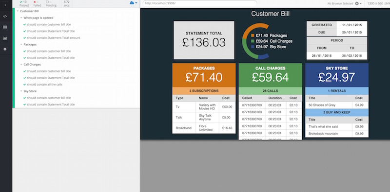

### Node Version

This project uses node version 4.0.0

To run commands locally it is suggested that you use a 4.0.0 node environment or a version manager.

```
nvm use
```

## Development

To run the developer environment:

```
npm run dev [-- --config==staging]
```

`npm run dev` defaults to development configuration file.

## Integration Tests

To run the integration tests there is one global dependency:

```
npm i -g cypress
cypress install
```

Then, you must first build the project locally.
Then you will need to serve the application on `localhost:9999`. You can do this with `npm run gulp -- serve.dist`.
Finally run the cypress test suite.

```
npm run gulp -- build
npm run gulp -- serve.dist &
cypress run
kill %1
```



### Notes

This application utilises ES7 features through babel, hot reloading with an optimum developer experience to display errors.

The aim of this project is to display an aesthetic and responsive bill.

To fit the use case of this bill, it has been developed with **low latency**. Currently this project serves only 80KB in total.

### Features

- Hot reload developer experience, live reload fallback, sourcmaps
- Fully responsive
- Only 80KB compressed production build
- Tested on Evergreen Safari, Chrome, Edge, IE11 & Firefox
- Scrolling fixed header tables
- Meter Component with complex animation and SVG display of bill
- CI tests
- Easy to maintain and improve UX
- Redux library integration as an evolution beyond the Flux design pattern
- Reusible build tasks with gulp and webpack
- Staging build
- Loading spinners for initial feedback
- React version 14 RC
- Modern design patterns to control data flow, manage state and dependencies.
- Only one global NPM dependency for running CI tests


